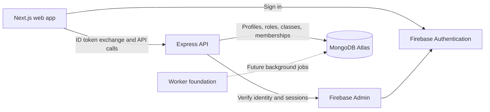

# EduFlux

A modern education platform for clearer teaching, simpler class management, and better student support.

[**Live Demo →**](https://eduflux-web.vercel.app/)


EduFlux brings identity, class spaces, and role-based access into one focused experience. Teachers can create classes and share join codes. Students can join those classes and see them from their own dashboard.

The repository currently provides the platform foundation. Learning workflows such as assignments, submissions, assessment, and analytics are planned and are not presented as finished features.

## Table of contents

- [About EduFlux](#about-eduflux)
- [Project status](#project-status)
- [Features](#features)
- [Teacher features](#teacher-features)
- [Student features](#student-features)
- [Planned admin features](#planned-admin-features)
- [Authentication and security](#authentication-and-security)
- [Technology stack](#technology-stack)
- [Architecture](#architecture)
- [Project structure](#project-structure)
- [How EduFlux works](#how-eduflux-works)
- [UI, motion, and accessibility](#ui-motion-and-accessibility)
- [Getting started](#getting-started)
- [Environment variables](#environment-variables)
- [Available commands](#available-commands)
- [Testing](#testing)
- [Performance](#performance)
- [Deployment](#deployment)
- [Roadmap](#roadmap)

## About EduFlux

EduFlux is an education SaaS project for teachers, students, classes, and schools. Its goal is to make everyday learning work easier to manage without taking control away from teachers.

The current application focuses on a secure starting point: a responsive public website, Firebase sign-in, persona onboarding, protected dashboards, and server-controlled class access.

Future stages will build assignments, submissions, feedback, learning tools, and reporting on top of this foundation.

## Project status

### Available now

- [x] Premium responsive marketing website
- [x] Firebase email/password authentication integration
- [x] Firebase Google sign-in integration
- [x] Secure server-side session exchange
- [x] Teacher and Student onboarding
- [x] MongoDB user profiles and role architecture
- [x] Protected Teacher and Student dashboards
- [x] Class creation with generated join codes
- [x] Student class joining
- [x] Class listings and class detail views
- [x] Teacher access to paginated class members
- [x] Role-based class authorization
- [x] Unit, integration, and browser tests

### Planned

- [ ] Assignments, rubrics, submissions, and file uploads
- [ ] Feedback, OCR, and AI-assisted assessment
- [ ] Flashcards, worksheets, progress, and analytics
- [ ] Admin, notifications, background jobs, and payments

## Features

### Authentication

- Register as a Teacher or Student with email and password
- Sign in with email/password or Google
- Complete Teacher/Student onboarding after a new Google sign-in
- Continue through a secure HttpOnly server session
- Sign out from the current session or revoke all Firebase sessions

### Classes

- Teachers create classes and receive an eight-character join code
- Students join with a valid code
- Both personas see their classes on a responsive dashboard
- Members can open class detail pages
- Owners and class teachers can view the member list
- Membership records, rather than browser input, control class permissions

### Marketing experience

- Responsive editorial homepage
- GSAP and ScrollTrigger motion system
- A Three.js intelligence-core scene built with React Three Fiber
- Desktop, tablet, mobile, and reduced-motion behavior
- A single dynamically loaded WebGL canvas

## Teacher features

Teachers can currently:

- Create an account with the Teacher persona
- Sign in with email/password or Google
- Open the protected Teacher dashboard
- Create a class with an optional description
- Receive and copy a generated join code
- View their classes and member counts
- Open a class and view its members
- Sign out securely

### Planned Teacher features

- Create assignments, rubrics, and review workflows
- Add comments, corrections, and AI-assisted feedback
- Read handwritten work through OCR
- Generate learning tools and review analytics

## Student features

Students can currently:

- Create an account with the Student persona
- Sign in with email/password or Google
- Open the protected Student dashboard
- Join a class with an eight-character code
- View and open joined classes
- Sign out securely

Students cannot use teacher-only member-management access.

### Planned Student features

- View and submit assigned work
- Receive feedback, corrections, and next steps
- Practise with flashcards and worksheets
- Track progress over time

## Planned Admin features

Admin infrastructure is planned, but the full Admin dashboard is not yet available.

The shared role model reserves `USER`, `ADMIN`, and `SUPER_ADMIN` platform roles. There are currently no Admin pages or user-management routes.

Possible future Admin work includes user and class management, platform activity, reports, settings, subscriptions, and health monitoring.

## Authentication and security

EduFlux uses Firebase Authentication for identity and MongoDB for application profiles and permissions.

- Firebase handles email/password and Google identity.
- The browser exchanges a fresh Firebase ID token with the Express API.
- Firebase Admin verifies that identity and checks recent authentication.
- Express creates an HttpOnly Firebase session cookie.
- The browser-side Firebase state is cleared after the exchange.
- MongoDB stores the persona, platform role, account status, classes, and memberships.
- Protected requests verify session revocation and load the active MongoDB user.

The API also includes:

- CSRF protection for mutations
- Exact trusted-origin checks
- Authentication and class-join rate limits
- Secure production cookie settings
- Request IDs and sensitive-field log redaction
- Disabled-account enforcement
- Zod validation at request boundaries

### Role model

| Scope            | Roles                          | Purpose                                       |
| ---------------- | ------------------------------ | --------------------------------------------- |
| User persona     | `TEACHER`, `STUDENT`           | Chooses the dashboard and starting experience |
| Platform         | `USER`, `ADMIN`, `SUPER_ADMIN` | Reserves application-wide privilege levels    |
| Class membership | `OWNER`, `TEACHER`, `STUDENT`  | Controls access inside a specific class       |

A signup persona does not grant ownership of every class. Class permissions come from the user’s membership in that class.

## Technology stack

| Area                 | Technology                                     |
| -------------------- | ---------------------------------------------- |
| Frontend             | Next.js 16, React 19, TypeScript               |
| Styling              | CSS, Tailwind CSS toolchain                    |
| Motion               | GSAP, ScrollTrigger                            |
| 3D                   | Three.js, React Three Fiber, Drei              |
| API                  | Node.js, Express 5                             |
| Database             | MongoDB Atlas, Mongoose                        |
| Authentication       | Firebase Authentication, Firebase Admin        |
| Validation           | Zod                                            |
| Logging and security | Pino, Helmet, CORS, rate limiting              |
| Monorepo             | pnpm workspaces, Turborepo                     |
| Testing              | Vitest, Testing Library, Supertest, Playwright |
| Frontend deployment  | Vercel                                         |

## Architecture



- **Next.js** provides the public website, authentication screens, and protected dashboards.
- **Express** owns API boundaries, sessions, security checks, and authorization.
- **Firebase** owns primary user identity and authentication providers.
- **MongoDB** owns application data and permissions.
- **Worker** is a compiled foundation only; no queues or background tasks are configured yet.

## Project structure

```text
EDUFLUX/
├── apps/
│   ├── web/              # Next.js frontend and Playwright tests
│   ├── api/              # Express API and integration tests
│   └── worker/           # Background worker foundation
├── packages/
│   ├── config/           # Shared runtime defaults
│   ├── shared-types/     # Shared API and domain types
│   ├── utils/            # Shared utilities
│   └── validation/       # Shared Zod schemas
├── docs/
│   └── architecture.md
├── package.json
├── pnpm-workspace.yaml
└── turbo.json
```

## How EduFlux works

### Authentication flow

```text
User signs in with Firebase
        ↓
Browser receives a fresh ID token
        ↓
Express verifies it with Firebase Admin
        ↓
MongoDB user is created or updated
        ↓
Express sets an HttpOnly session cookie
        ↓
Teacher or Student dashboard opens
```

New Google users choose a Teacher or Student persona on the onboarding screen. The server accepts only those two persona values and does not let the browser assign platform or class roles.

### Class flow

```text
Teacher creates class → EduFlux generates join code → Teacher shares code

Student enters code → Membership is created → Class appears on dashboard
```

Every class action uses the MongoDB user ID. The `ClassMembership` record connects that user to a class and controls the user’s role there.

## UI, motion, and accessibility

EduFlux is designed for desktop, tablet, and mobile screens.

- Desktop uses the full editorial motion and 3D experience.
- Tablet keeps the Hero experience while reducing page-wide motion complexity.
- Mobile uses a touch-first layout and lighter animation behavior.
- Reduced-motion preferences disable non-essential GSAP motion and use a static 3D fallback.

The interface uses semantic headings, labelled controls, ARIA states where needed, visible keyboard focus, and an accessible mobile navigation menu. This is not a claim of formal WCAG certification.

## Getting started

### Prerequisites

- Node.js 24 or newer
- pnpm 12.4.1
- A Firebase project
- A MongoDB Atlas database or compatible MongoDB replica set

### Install and run

```bash
git clone https://github.com/tasinahammed01/EDUFLUX.git
cd EDUFLUX
pnpm install --frozen-lockfile
```

Create local environment files from the supplied examples, add your own credentials, and then run:

```bash
pnpm dev
```

The default local services are the web app at <http://localhost:3000> and the API at <http://localhost:5000>.

## Environment variables

Never commit local `.env` files, service-account JSON, private keys, passwords, tokens, or session values.

### Web — `apps/web/.env.local`

Copy `apps/web/.env.example` and configure:

```dotenv
NEXT_PUBLIC_SITE_URL=
API_INTERNAL_URL=
NEXT_PUBLIC_FIREBASE_API_KEY=
NEXT_PUBLIC_FIREBASE_AUTH_DOMAIN=
NEXT_PUBLIC_FIREBASE_PROJECT_ID=
NEXT_PUBLIC_FIREBASE_STORAGE_BUCKET=
NEXT_PUBLIC_FIREBASE_MESSAGING_SENDER_ID=
NEXT_PUBLIC_FIREBASE_APP_ID=
```

### API — `apps/api/.env`

Copy `apps/api/.env.example` and configure:

```dotenv
NODE_ENV=
PORT=
WEB_ORIGIN=
LOG_LEVEL=
MONGODB_URI=
FIREBASE_PROJECT_ID=
FIREBASE_CLIENT_EMAIL=
FIREBASE_PRIVATE_KEY=
CSRF_SECRET=
FIREBASE_SESSION_TTL_DAYS=
TRUST_PROXY_HOPS=
MONGODB_MAX_POOL_SIZE=
```

The API can alternatively use Application Default Credentials through `GOOGLE_APPLICATION_CREDENTIALS`.

### Firebase setup

1. Create a Firebase project.
2. Enable Email/Password and Google sign-in providers.
3. Add local and deployed web hosts to Firebase authorized domains.
4. Add the Firebase Web configuration to the web environment file.
5. Configure Firebase Admin credentials for the API.

### MongoDB setup

1. Create an Atlas cluster and database user.
2. Allow only the network access needed by development and deployment environments.
3. Copy the connection string into `MONGODB_URI` and select the `eduflux` database.
4. Do not leave unrestricted network access enabled in production.

Existing custom-auth users need a deliberate migration to Firebase UIDs before the unique Firebase UID index is created. Do not run index synchronization blindly against data that has not been audited.

## Available commands

Run these commands from the repository root.

| Command                                 | Purpose                                                           |
| --------------------------------------- | ----------------------------------------------------------------- |
| `pnpm dev`                              | Start development tasks through Turborepo                         |
| `pnpm build`                            | Build all workspaces                                              |
| `pnpm lint`                             | Run repository lint checks                                        |
| `pnpm typecheck`                        | Check TypeScript across the monorepo                              |
| `pnpm test`                             | Run workspace test suites                                         |
| `pnpm format`                           | Format repository files with Prettier                             |
| `pnpm format:check`                     | Check formatting without changing files                           |
| `pnpm --filter @eduflux/api db:indexes` | Create declared MongoDB indexes without dropping existing indexes |
| `pnpm --filter @eduflux/web test:e2e`   | Run Playwright browser tests                                      |

## Testing

The repository uses:

- **Vitest** for frontend and API tests
- **Testing Library** for authentication forms and mobile navigation
- **Supertest** for API behavior
- **mongodb-memory-server** for isolated replica-set integration tests
- **Playwright** for browser-level class and marketing flows

Current tests cover authentication exchange, session cookies, CSRF rejection, stale and invalid tokens, onboarding, disabled users, revocation, class creation, class joining, class authorization, responsive marketing behavior, reduced motion, and navigation.

Automated authentication uses a test-only identity gateway. It does not write to Firebase or MongoDB Atlas.

## Performance

Current performance choices include:

- Server Components by default in Next.js
- A statically generated marketing homepage
- Small client boundaries around interaction-heavy features
- Dynamically loaded WebGL with one canvas
- Capped device pixel ratio and lower mobile scene complexity
- Rendering paused when the 3D scene is hidden or off-screen
- No Firebase authentication bundle in the homepage source graph
- Indexed MongoDB user and membership lookups
- Batched class and member-count queries instead of one query per card

No Lighthouse score is claimed because one is not recorded in this repository.

## Deployment

**Live frontend:** [https://eduflux-web.vercel.app/](https://eduflux-web.vercel.app/)

The deployment model separates each application:

- `apps/web`: Vercel project with Root Directory set to `apps/web` and framework set to Next.js
- `apps/api`: separate Node.js deployment with Firebase Admin and Atlas credentials
- `apps/worker`: deployed later when background processing is introduced

The Next.js build output is `apps/web/.next`; the app does not use static export. MongoDB Atlas stores application data, while Firebase provides authentication.

This README does not claim that the API or worker has a public deployment.

## Roadmap

### Foundation

- [x] pnpm and Turborepo monorepo
- [x] Responsive marketing website
- [x] Firebase identity and server-session architecture
- [x] User personas and platform role model
- [x] Teacher and Student dashboards
- [x] Classes and membership authorization

### Learning workflow

- [ ] Assignments, rubrics, submissions, and file uploads
- [ ] Teacher review and comments

### Assisted learning

- [ ] OCR, AI-assisted assessment, and writing feedback
- [ ] Adaptive practice, flashcards, and worksheets

### Platform

- [ ] Student analytics and Admin dashboard
- [ ] Notifications, billing, and background job queues

EduFlux is under active development. Implemented and planned features are kept separate so the current product scope stays clear. The source is available at [github.com/tasinahammed01/EDUFLUX](https://github.com/tasinahammed01/EDUFLUX).
